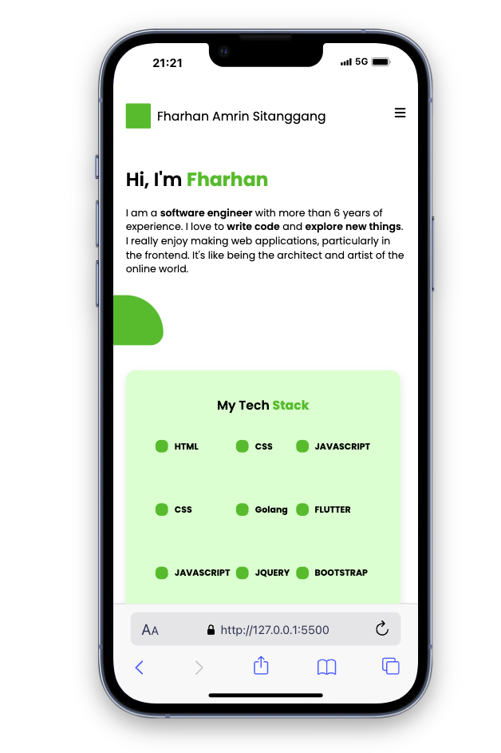
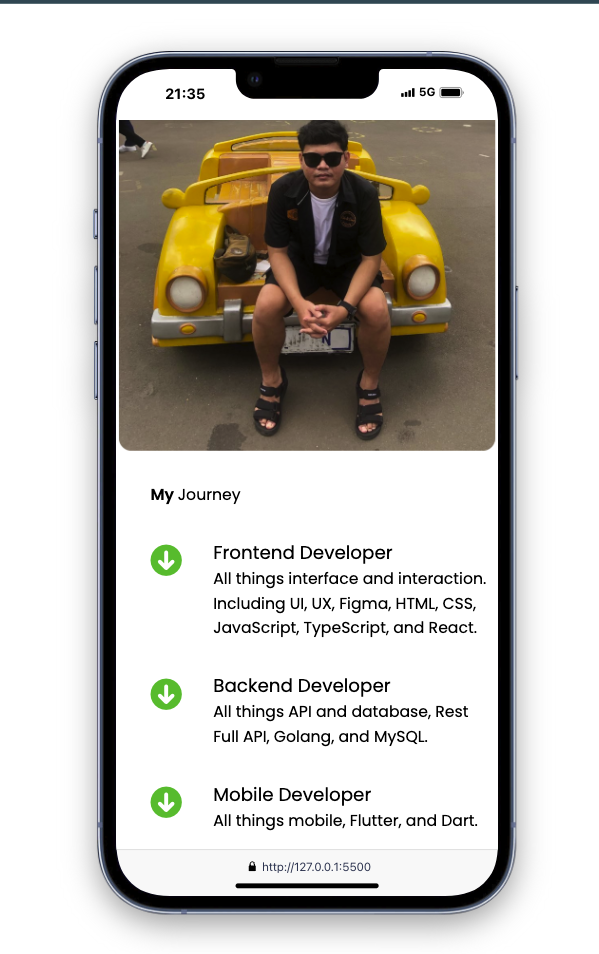
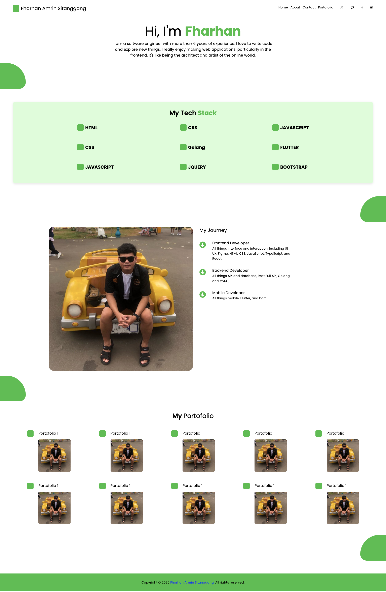

# Website Profile
## Mobile Version
### Hi! I’m Fharhan
```txt
I am a **software engineer** with more than 6 years of 
experience. I love to write codes and explore new things. 
I really enjoy making web application, particularly in 
the frontend. It's like being the architect and artist of the 
online world.
```
#### My Tech Stack
* HTML 
* CSS
* JAVASCRIPT
* PHP
* GOLANG
* JQUERY
* FLUTTER
* REACT NATIVE






#### My Journey
* Frontend Web 
```txt
All things interface and interaction.
Including UI, UX, Figma, HTML, CSS, 
JavaScript, TypeScript, and React.
```

* Backend Web 
```txt
All things API and database, Rest Full API, 
Golang, and MySQL.
```

* MOBILE DEV
```txt
All things mobile, Flutter, and Dart.
```

## Desktop Version


